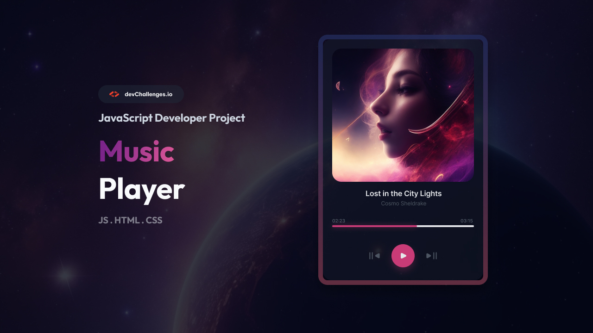

<h1 align="center">Music Player | devChallenges</h1>

<div align="center">
   Solution for a challenge <a href="https://devchallenges.io/challenge/music-player" target="_blank">Music Player</a> from <a href="http://devchallenges.io" target="_blank">devChallenges.io</a>.
</div>

<div align="center">
  <h3>
    <a href="https://bechagas.github.io/music-player-vanila/">
      Demo
    </a>
    <span> | </span>
    <a href="https://devchallenges.io/solution/66472">
      Solution
    </a>
    <span> | </span>
    <a href="https://devchallenges.io/challenge/music-player">
      Challenge
    </a>
  </h3>
</div>

<!-- TABLE OF CONTENTS -->

## Table of Contents

- [Overview](#overview)
  - [Built with](#built-with)
  - [What I learned](#what-i-learned)
- [Features](#features)
- [How to use](#how-to-use)
- [Author](#author)

<!-- OVERVIEW -->

## Overview



This project is a responsive Music Player built as part of a DevChallenges.io challenge. It focuses on clean UI/UX using modern CSS techniques like glassmorphism and a robust implementation of the HTML5 Audio API for a seamless listening experience.

### Built with

- Semantic HTML5 markup
- CSS Custom Properties (Variables)
- Flexbox
- Vanilla JavaScript (No frameworks)
- HTML5 Audio API

### What I learned

Working on this project reinforced my knowledge of:
- **HTML5 Audio API**: Managing playback, volume, and tracking progress through events like `timeupdate` and `loadedmetadata`.
- **Dynamic CSS**: Creating a custom progress bar that "paints" itself in real-time using dynamic `linear-gradient` backgrounds controlled via JS.
- **Glassmorphism Design**: Implementing professional-looking UI with `backdrop-filter` and `drop-shadow`.
- **State Management**: Using the modulo operator `%` to create a circular navigation logic (infinite playlist) in a simple and efficient way.

```javascript
// Example of the infinite loop logic for navigation
function changeMusic(direction) {
  currentSongIndex = (currentSongIndex + direction + songs.length) % songs.length;
  loadSong(currentSongIndex);
  playMusic();
}
```

## Features

- **Playback Control**: Play and pause songs with immediate visual feedback.
- **Playlist Navigation**: Skip to the next or previous track with an infinite loop logic.
- **Interactive Progress Bar**: View the current progress and click/drag to skip to any part of the song.
- **Real-time Metadata**: Displays current song title, artist, cover image, and duration dynamically.
- **Responsive & Modern UI**: Beautiful glassmorphism effect that adapts to different screen sizes.

## How to use

To clone and run this application, you'll need [Git](https://git-scm.com) installed on your computer. From your command line:

```bash
# Clone this repository
$ git clone https://github.com/bechagas/music-player-vanila

# Go into the repository
$ cd music-player-vanila

# Add your songs in the tracks folder or use external URL

# Open index.html in your browser with Live Server
```

## Author

- GitHub: [@bechagas](https://github.com/bechagas)